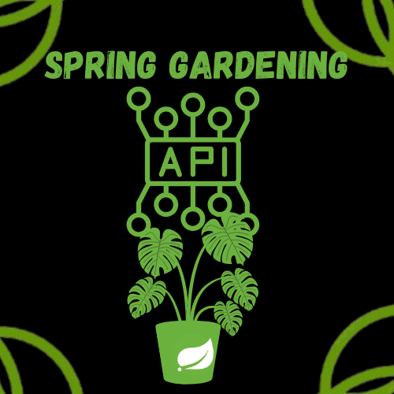

    
  
  # **Your title**
  Spring Gardening
  ## **DESCRIPTION**
  Spring Gardening is a spring-related API created from scratch using several classes, controllers, services, and repositories. All created entries in our API are displayed on the frontend using Thymeleaf HTML. The user can create plants, vegetables, fruits, flowers, and spring events. Plants have a name and description, but the one-to-many relationship between plants, vegetables, fruits, and flowers allows plants to have daily_nurturing and gardening_tips assigned to them as well.

  COLOR PALETTE            |  DEMO
:-------------------------:|:-------------------------:
   |   

## **KEY FEATURES:**
- Frontend for displaying spring-related API items using Thymeleaf
- Multiple controllers for handling PUT, POST, DELETE, and GET methods
- Services to handle passing data from our controllers and main classes to the HTML document
- Repositories for handling data storing
- Database relationships Many-to-many, Many-to-one

## **HOW TO USE (Intellij)**
POST a Plant:
POST http://localhost:8080/plants
Content-Type: application/json
{
  "name": "Sunflower",
  "description": "Sunflowers are tall, annual plants known for their large yellow flower heads. They track the sun (heliotropism) and are pollinated by bees. Their seeds are used in food and oil production. Sunflowers thrive in full sun and well-drained soil.",
  "imageFilename": "sunflower.jpg"
}

POST a Flower:
POST http://localhost:8080/flowers
Content-Type: application/json

{
  "daily_nurturing": "Sunlight: Ensure they get at least 6–8 hours of direct sunlight each day. Weeding: Keep the area around the sunflower free of weeds to avoid competition for nutrients and water. Watering: Keep the soil consistently moist, especially when the plant is young. Once established, sunflowers are drought-tolerant but benefit from deep watering during dry spells. Support: Tall sunflowers may need staking to prevent wind damage, especially as they grow taller.",
  "gardening_tips": "Fertilizing: Sunflowers are light feeders but benefit from a balanced, slow-release fertilizer during early growth. Over-fertilizing can lead to weak stems. Mulching: Apply a layer of mulch around the base to help retain moisture, suppress weeds, and keep the soil temperature stable. Pest Control: Keep an eye out for pests like aphids, beetles, and caterpillars. If necessary, use insecticidal soap or neem oil to keep them at bay."

}

GET the Sunflower:
GET http://localhost:8080/plants/1

PUT a Flower to Plant (Add a flower to a plant)
PUT http://localhost:8080/flowers/1/plants/1

DELETE the Sunflower 
DELETE http://localhost:8080/plants/1

